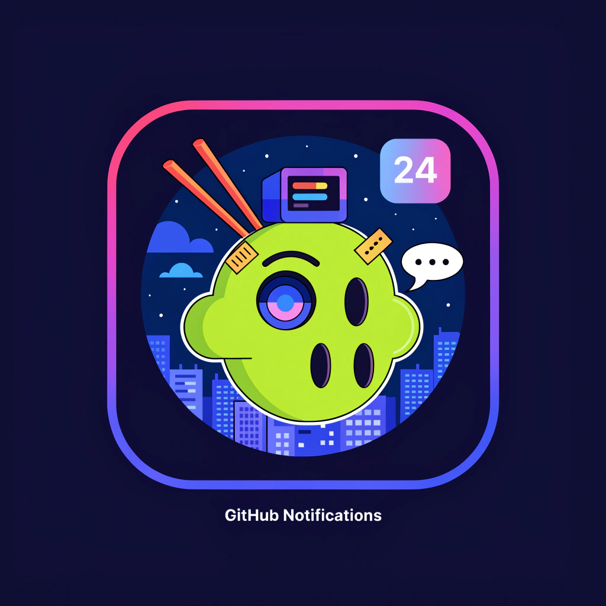

<p align="center">
  
</p>

<h1 align="center">GitHub Notifier</h1>

<p align="center">
  A floating dot for your macOS desktop that polls GitHub for PR notifications and prints them like a receipt.
</p>

<p align="center">
  
  
  
  
</p>

---

## Quick Start

```bash
open github-notifier.app --args --mock    # try it with fake data
open github-notifier.app                   # real GitHub notifications
```

See [Installation](docs/INSTALL.md) for building from source and [Configuration](docs/CONFIGURATION.md) for setup.

## Features at a Glance

- Minimal floating dot — always-on-top, drag anywhere with Cmd+click
- Receipt-printing notification toasts — each prints down one at a time
- Full receipt panel — grouped by PR, with Confirm/Open/DND/Settings
- Scheduled polling — configure days, hours, and Do Not Disturb
- Persistent state — confirmed notifications stay across restarts

## Docs

| Document | What's in it |
|---|---|
| [Installation](docs/INSTALL.md) | Prerequisites, building from source, dev setup |
| [Configuration](docs/CONFIGURATION.md) | All settings, config file reference, state |
| [Usage](docs/USAGE.md) | Dot controls, receipt panel, toasts, DND |
| [Architecture](docs/ARCHITECTURE.md) | Project structure, data flow, backend packages |

## Build

```bash
go install github.com/wailsapp/wails/v2/cmd/wails@latest
git clone https://github.com/scott-janes/github-notifier
cd github-notifier && wails build
open build/bin/github-notifier.app
```

## License

MIT
